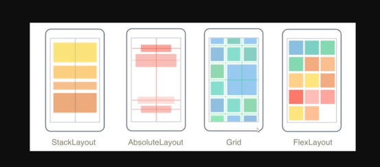
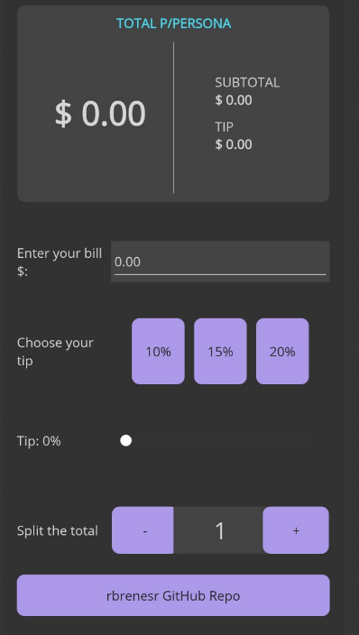

# Curso de .NET MAUI con Visual Studio 2022 creando PROYECTOS
## Hector Uriel Pérez
### https://elcamino.dev/

# Seccion 1 - Introducción
- Instalación de Visual Studio 2022
- Hablitar Emulador Android

# Seccion 2 - Introducción lengiaje XAML
- XAML: Lenguaje de mercado para diseño gráfico en MAUI
- App.xaml: se especifica cual es el archivo inicial de la aplicación


# Seccion 3 - Páginas

### ContentPage
- Tipo de página que nos permite agregar Layouts y controles (más utilizadas)
- Sólo puede contener un elemento como nivel raíz en la gerarquía

### NavigationPage
- Pila de navegacion

```
//Permite realizar la nagevación
Navigation.PushAsync(new ContentPageDemo());

// Permite quitar la página de la pila de navegación
Navigation.PopAsync();
```

```
// NavigationPage Nos permite enrutar la navegación, pues si  este encapsulado el proceso no es permitido (sin error)

//En App.xaml
MainPage = new NavigationPage(new MainPage());

// Para modificar su estrucura
NavigationPage navigationPage = new NavigationPage(new MainPage());
MainPage = navigationPage;

```
**Importante**  
-> Si se usa Navigation para navegar entre páginas, se realiza una instancia nueva de cada página, por lo que si hacemos este proceso de forma bidireccional, el contenido de una página por ejemplo de un input se perdera pues es una página nueva, por eso se usa el push/pop async


### FlyoutPage
- Utilizada como estilo menu bar para navegación.
- Al crear una nueva página de tipo COntectPage, se debe cambiar las etiquetas a FlyoutPage
- Se debe modificar la herencia de la página en el cs ```public partial class FlyoutPageDemo : ContentPage por FlyoutPage```
- Porpiedades FlyoutLayoutBehavior

```
<?xml version="1.0" encoding="utf-8" ?>
<FlyoutPage xmlns="http://schemas.microsoft.com/dotnet/2021/maui"
             xmlns:x="http://schemas.microsoft.com/winfx/2009/xaml"
             x:Class="PagesDemo.FlyoutPageDemo"
             Title="FlyoutPageDemo"
            FlyoutLayoutBehavior="Popover">

    <FlyoutPage.Flyout>
        <ContentPage Title="My App" BackgroundColor="Azure">
            <Label
                Text="Label from flyout"
                HorizontalTextAlignment="Center"
                VerticalTextAlignment="Center"
                ></Label>
        </ContentPage>
    </FlyoutPage.Flyout>

    <FlyoutPage.Detail>
        <ContentPage BackgroundColor="Indigo">
            <Label
       Text="Label from detail"
       HorizontalTextAlignment="Center"
       VerticalTextAlignment="Center"
       ></Label>

        </ContentPage>
    </FlyoutPage.Detail>
</FlyoutPage>
```

### TabbedPage
- Página basada en pestañas

```
<?xml version="1.0" encoding="utf-8" ?>
<TabbedPage xmlns="http://schemas.microsoft.com/dotnet/2021/maui"
             xmlns:x="http://schemas.microsoft.com/winfx/2009/xaml"
             x:Class="PagesDemo.TabbedPageDemo"
             Title="TabbedPageDemo"
            BarBackgroundColor="DarkBlue"
            BarTextColor="White"
            SelectedTabColor="DarkRed"
            UnselectedTabColor="DarkCyan">

    <ContentPage Title="Page 1" IconImageSource="dotnet_bot.png"></ContentPage>
    <ContentPage Title="Page 2" IconImageSource="dotnet_bot.png"></ContentPage>
    <ContentPage Title="Page 2" IconImageSource="dotnet_bot.png"></ContentPage>
    
</TabbedPage>
```


# Seccion 4 - Layouts

Diferentes tipos de layouts




### StackLayout

- Organiza los elementos en uan pila unidireccional ya sea verticar u horizontalmente.
- Se organiza nosrmalmente para organizar una subsección de una página
- SctackLayout == VerticalStackLayout


### GridLayout

- Definición de medidas 

```
Auto = justo el tamaño del control contenido
valor ejmp 100 = el valor de unidades especificado
* = Todo el espacio disponible
.4* = aplicado de manera porcentual
```

```
<?xml version="1.0" encoding="utf-8" ?>
<ContentPage xmlns="http://schemas.microsoft.com/dotnet/2021/maui"
             xmlns:x="http://schemas.microsoft.com/winfx/2009/xaml"
             x:Class="GridLayoutDemo.GridLayoutDemo"
             Title="GridLayoutDemo">
    <!--<Grid Background="Aqua" RowSpacing="10">-->
        <Grid RowDefinitions=".2*, .8*" ColumnDefinitions="30,*" Background="Aqua" RowSpacing="10">
        <!--<Grid.RowDefinitions>
            <RowDefinition Height=".1*"/>
            <RowDefinition Height=".9*"/>
        </Grid.RowDefinitions>

        <Grid.ColumnDefinitions>
            <ColumnDefinition Width="*"/>
            <ColumnDefinition Width="*"/>
        </Grid.ColumnDefinitions>-->

        <Button  HeightRequest="200"
            Text="Welcome to .NET MAUI!"/>
        
        <Button 
            Text="Btn #2"            
            Grid.Row="1" Grid.Column="0" Grid.ColumnSpan="2"/>
    </Grid>
</ContentPage>
```

# Seccion 5 - Controls

- Controles de presentación
- Controles que inician comandos
- Establecer valores
- Edición de texto
- Indicar actividad
- Desplegar colecciones

Repo File project: 04-Controles

# Seccion 6 - Protecto Color Maker

- Inslatar paquete CommunityToolkit.Maui
```
//En MauiProgram.cs se debe inyectar la dependencia
builder.UseMauiApp<App>().UseMauiCommunityToolkit();
```
- ContentResources: Nos permite definir recursos globales en nuestra 
ContyestPage


```
   <ContentPage.Resources>
       <Color x:Key="Primary">#ab3527</Color>
       <Color x:Key="Secondary">#775752</Color>
       <Color x:Key="Tertiary">#705c2e</Color>
   </ContentPage.Resources>
```

# Seccion 7 - Proyecto Perfect Pay

En este proyecto, se tiene como objetivo cálcular la cuenta a pagar en partes iguales según la cantidad de personas que escojamos.




# Seccion 8 - Trabajando con recursos externos

## Imágenes

El path para colocar las imagenes es ..\Resources\Images\

MAUI Acepta varios tiempos de imágenes, como los más comunes {jpg, png, gif, ...}

```
//La extensión de la imagen no es necesaria, siempre y cuando solo un archivo con el misno nombre existA.
  <Image Source="automovil"></Image>
  <Image Source="automovil.jpg"></Image>
```


Para el caso de las imagenes gif, se debe indicar / configurar IsAnimationPlaying

```
<Image Source="gif.gif" IsAnimationPlaying="True"></Image>
```

Para el caso de las imagenes svg, es necesario configurar y establecer un tamaño base, para que el framework tome este valor como referencia y realice el ajuste correspondiente.

```
<Image Source="svg.svg"></Image>
```

Para esto, se debe dar doble clic en el proyecto ( propiedades del proyecto)

```
//BaseSize

<!-- Images -->
<MauiImage Include="Resources\Images\*" />
<MauiImage Update="Resources\Images\dotnet_bot.png" Resize="True" BaseSize="300,185" />
<MauiImage Update="Resources\Images\svg.svg" Resize="True" BaseSize="300,185" />
```
Además puede modificarse le color de la imagen usando la propiedad TintColor

```
<MauiImage Update="Resources\Images\svg.svg" Resize="True" BaseSize="800,800" TintColor="DarkRed" />
```


## Tipografías

El path para colocar las imagenes es ..\Resources\Fonts\


``` https://fontello.com/ ```

 ```
 <Image>
     <Image.Source>
         <FontImageSource FontFamily="Iconos"
                          Glyph="&#xF0E0;" Size="50">
             
         </FontImageSource>
     </Image.Source>
 </Image>
```


Agregar las fuentes en MauiProgram


```
 builder
     .UseMauiApp<App>()
     .ConfigureFonts(fonts =>
     {
         fonts.AddFont("OpenSans-Regular.ttf", "OpenSansRegular");
         fonts.AddFont("OpenSans-Semibold.ttf", "OpenSansSemibold");
         fonts.AddFont("PoetsenOne-Regular.ttf", "Myfont");
         fonts.AddFont("fontello.ttf", "Iconos");
     });
```


## Otros archivos externos

El path para colocar las imagenes es ..\Resources\raw\


Podemos utilizar OnAppearing para ionvocar metodos async

```
 protected override void OnAppearing()
 {
     base.OnAppearing();

     LoadMauiAsset();
 }
```

# Seccion 9 - Proyecto #3 CodeQuotes

-> Existen dos tipós de degradados, lineales y circulares

Para aplicar degradado, lo accesos accediendo a la propiedad Background de la grilla, en fin de varios elementos como un frame

Posiciones para cada esquina:  
0,0-1,0  
0,1-1,1


```
<Grid BackgroundColor="Navy">
    <Grid.Background>
        <LinearGradientBrush StartPoint="0,0"
                             EndPoint="1,1">

            <GradientStopCollection>
                <GradientStop Color="DarkBlue" Offset="0" />
                <GradientStop Color="DarkBlue" Offset="0" />
            </GradientStopCollection>
        </LinearGradientBrush>
```

